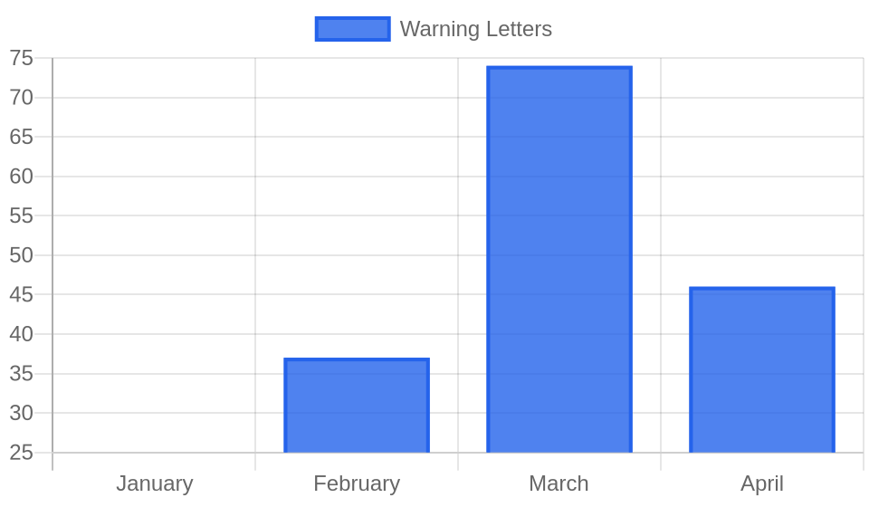

# Weekly FDA Roundup — May 2–8, 2026 (DRAFT for review)

> [!NOTE]
> This is the first of 12 catch-up posts, drafted for your review. Nothing is published. If the style, length, and image look right, I'll produce the other 11 the same way.

**Headline:** Weekly FDA Roundup: A Class I Pacemaker Recall, a 23-Warning-Letter Day, and the First Flavored E-Cigarette Ever Authorized, May 2–8, 2026

---

The most serious thing FDA did this week did not involve a new rule or a splashy approval. It was a battery. On May 7 the agency issued a Class I recall, its most serious category, for six families of Boston Scientific pacemakers, and warned that some patients may need surgery to swap the device out ahead of schedule. That single action sat at the center of a week that also brought 23 warning letters in a single day, the first flavored e-cigarette the agency has ever cleared for sale, and a quiet set of announcements about how FDA plans to inspect and analyze the industry going forward.

Here is what mattered from May 2 to May 8, and what it means if you make an FDA-regulated product.

## By the numbers

- **80 regulatory actions** captured this week across every FDA sector
- **23 warning letters**, all posted May 5, spanning pharma, supplements, seafood, importers, and tobacco
- **3 Class I device actions**: pacemakers, sizing catheters, and angiographic syringe kits
- **1 infant formula recall** tied to a heat-stable bacterial toxin
- **1 first-of-its-kind authorization**: a flavored ENDS product cleared with biometric age-gating

## Lead story: a pacemaker battery flaw that can force devices into "Safety Mode"

FDA classified the recall of Boston Scientific's **Accolade** pacemaker line, along with the **Proponent, Essentio, Altrua 2, Visionist, and Valitude** pacemakers and CRT-Ps, as Class I. The root problem is a manufacturing anomaly in the battery cathode. In affected devices it can trigger a protective failsafe that drops the pacemaker into a limited-function "Safety Mode," which delivers only basic pacing and, once entered, requires surgical replacement to restore full function.

Boston Scientific has been chasing this issue for months. The company released a software update, Brady SMR6, that lowers the odds of a device entering Safety Mode in a normal ambulatory setting and corrects two behaviors introduced by an earlier update. FDA's May 7 safety communication goes a step further than the software fix, telling clinicians that a subset of patients may still face early device replacement. The stakes are not theoretical. As of mid-March, the agency and manufacturer had associated the battery issue with four deaths and more than 2,500 serious injuries.

For anyone in the implantable device space, this is a reminder that a component-level manufacturing defect can escalate into a Class I recall involving repeat surgeries, and that a software mitigation does not necessarily close out the underlying hardware risk.

## Key developments

### The same defective syringe keeps pulling products off the market

Two more Class I recalls landed May 7, both for convenience kits built around the **Medline Namic Angiographic Rotating Adaptor Control Syringe**. **Medical Action Industries** and **American Contract Systems** each recalled Cath Pack kits containing the part. The rotating adaptor can unwind during use and loosen or fully disconnect from the manifold, which risks air embolism, significant blood loss, and biohazard exposure. FDA has confirmed four serious injuries.

We flagged this exact component in our April 11 to 17 roundup, when two other kit makers recalled products over the same Namic syringe defect. A month later it is still surfacing in new kits from new manufacturers. When a single sourced component fails, every downstream packager that used it inherits the recall, and the cleanup tends to arrive in waves rather than all at once.

### A 23-warning-letter day, with data integrity at the center

Every warning letter posted this week carried the same date, May 5, and together they touched nearly every corner of FDA's jurisdiction: pharmaceutical CGMP, dietary supplements, seafood HACCP, foreign supplier verification, and tobacco e-commerce. The standout was **Ava Inc.**, a drug manufacturer cited for data integrity failures that read like a checklist of what inspectors most want to find. Investigators documented deleted analytical sequences, undocumented "trial" injections used to coax a topical solution toward passing results, no access controls on lab equipment, and a Quality Control Unit that failed to investigate out-of-specification findings.

Data integrity has been a running thread in FDA's pharma enforcement all year, and Ava is a clean example of why: the violations are not about a single bad batch, they are about whether any of the company's results can be trusted at all.

### Cereulide in infant formula

**The a2 Milk Company** recalled three batches of its imported a2 Platinum Premium infant formula after testing found **cereulide**, a toxin produced by *Bacillus cereus*. Cereulide is heat-stable, so preparing the formula with hot water does not destroy it. The affected product reached families nationally through Amazon, Meijer, and the company's own site, some of it under Operation Fly Formula. No illnesses have been reported. Contamination in infant formula draws immediate attention regardless of case count, and a heat-stable toxin removes the usual "just prepare it properly" fallback.

### FDA's quiet modernization week

Three announcements landed within 48 hours that say more about FDA's direction than any single enforcement action. The agency launched **Elsa 4.0**, an upgraded internal AI tool, alongside **HALO**, a consolidated platform that pulls more than 40 previously separate data sources and portals into one searchable system across all FDA centers. FDA was careful to note the systems run in a secure FedRAMP High environment and do not train on submitted industry data. Separately, the agency opened a pilot for **one-day inspectional assessments**, short visits to lower-risk food, biologics, and medical-product facilities meant to feed its risk-based prediction models. The throughline is an agency trying to see more of the industry with the same headcount, and leaning on data infrastructure to do it.

### Tobacco's two-track day

On May 5 FDA authorized four **Glas** ENDS products containing 5% nicotine, its first-ever clearance of a flavored e-cigarette outside tobacco and menthol. The agency permitted it because the manufacturer built in biometric and smartphone-based age verification, and the order carries strict post-market requirements for age-gating and targeted advertising. In the same window, the Center for Tobacco Products finalized guidance laying out its enforcement priorities against ENDS and nicotine-pouch products sold without authorization, and three vape websites received warning letters. The message to the category is that the legal path just widened for companies willing to build in youth-access controls, and narrowed for everyone selling around the process.

## The bigger picture

A 23-letter day is not an outlier so much as a continuation. Warning-letter volume climbed through the first quarter, peaked in March, and stayed elevated into spring.

Pair that enforcement pace with this week's modernization announcements and a pattern comes into focus. FDA is expanding both the reach of its surveillance (more inspections, consolidated data, internal AI) and the tempo of its enforcement. For regulated companies, the practical read is that the surface area FDA can see is growing, and the lag between a problem and a public action is likely to shrink.

## What to watch

- **National Priority Voucher program, June 4 and June 29.** FDA granted its seventh CNPV approval this week (Bizengri, for NRG1 fusion-positive cholangiocarcinoma) and scheduled a June 4 public meeting on how the pilot picks and processes candidates. Public comments are open through June 29.
- **One-day inspectional assessments, through September 30.** The pilot runs the rest of fiscal 2026. If your facility falls in the lower-risk tier for food, biologics, or medical products, a shorter unannounced visit is now on the table.
- **Postapproval pregnancy safety.** FDA finalized guidance on collecting safety data for drugs and biologics used in pregnancy, pointing industry toward registries, real-world data, and structured case reports to inform labeling.

---

*Policy Canary tracks every FDA action, warning letters, recalls, guidance, and rules, against the specific products you make, by name and by ingredient. [See what we would flag for your products](https://policycanary.io).*
