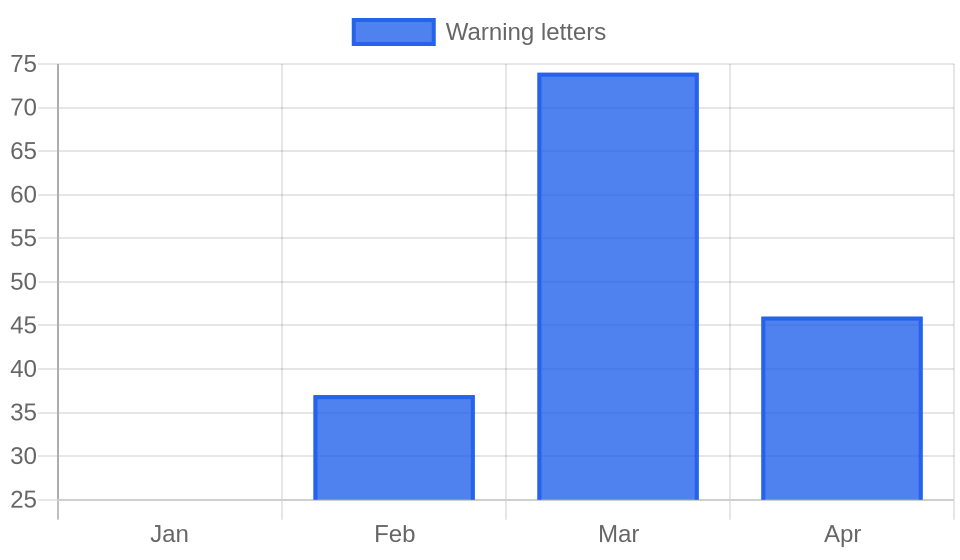

# Weekly FDA Roundup — May 16–22, 2026 (DRAFT for review)

> [!NOTE]
> Backfill draft, not published. Cover image, chart, and article below. Backdates to 2026-05-22 at publish.

**Headline:** Weekly FDA Roundup: a stent graft tied to three deaths, an 11-letter tobacco sweep, and the first HDV drug, May 16–22, 2026

**Slug:** `weekly-fda-roundup-2026-05-16`  ·  **Words:** 1235  ·  **Lead:** Bolton Medical Relay Pro thoracic stent graft Class I recall

---

The most serious FDA action this week was not a new rule or an approval. It was a stent graft. On May 20 the agency classified Bolton Medical's recall of the Relay Pro Thoracic Stent Graft System as Class I, its most serious category, after a mechanical failure that has already been linked to three deaths. It was one of four Class I recalls in a week that put critical-care devices, contaminated food ingredients, and online nicotine sellers under the agency's attention at once.

## By the numbers

- **59 FDA actions** logged May 16 through May 22.
- **21 warning letters**, of which **11** went to online tobacco and nicotine retailers.
- **4 Class I recalls**: Bolton Medical's Relay Pro stent graft, React Health's VOCSN V+Pro ventilators, Kroger-branded croutons made by Sugar Foods LLC, and Pure Ground Ingredients organic peppermint powder.
- **Standout approval**: Hepcludex (bulevirtide-gmod), the first-ever FDA-approved treatment for chronic hepatitis delta virus.

## Lead story: a stent graft that will not release, linked to three deaths

Bolton Medical's Relay Pro Thoracic Stent Graft System (N4 configuration) is used to repair the thoracic aorta, the largest artery in the body. FDA classified the company's recall as Class I on May 20 after reports that the device's proximal clasp can disconnect from the outer control tube during a procedure. When that happens the graft will not deploy as intended. The failure has been linked to three deaths and can force surgeons into emergency open-chest surgery to finish a repair that was supposed to be minimally invasive.

The danger here is timing. A thoracic aortic repair is often done under urgent conditions, and a device that fails mid-procedure leaves the surgical team improvising on a patient whose aorta is already compromised. A conversion to open surgery in that setting carries its own high mortality. This is the kind of defect that does not announce itself until the worst possible moment.

Hospitals and vascular surgeons using the Relay Pro N4 should check inventory against the recall notice and quarantine affected units. The recall points to a broader pattern from this week: the most severe items FDA handled were not headline approvals but quiet mechanical failures in devices that patients depend on to stay alive. Three of the week's four Class I recalls involved a device or an ingredient already in the field, in use, or on the shelf.

## Key developments

### FDA sends 11 warning letters to online tobacco sellers in two days
Between May 19 and May 20, FDA issued 11 warning letters to online tobacco and nicotine retailers, and it paired the sweep with a public statement. The agency announced warning letters to eight retailers marketing unauthorized nicotine pouches and dissolvable tobacco products packaged to look like candy, breath strips, and cough drops. FDA called the packaging a deliberate strategy to appeal to children and disguise use. One letter, to npouches.com, cited Hyde Nic Strips that imitate breath strips and pose an acute toxicity risk to young children. Others in the batch targeted vape sellers directly: vape4sale.com was cited for selling a Flum 50,000-puff disposable vape to a person under 21. Each retailer has 15 working days to respond. The week's letters continue a tobacco enforcement push that has run through the spring, and the disguised-product angle is new enough to signal where the agency is heading next.

### Two more critical-care devices pulled over life-threatening failures
The Relay Pro was not the only device recall tied to deaths this week. FDA classified React Health's recall of VOCSN V+Pro ventilators as Class I after a manufacturing deviation that causes an undetected oxygen leak. The leak can drop oxygen delivery below specification or raise fire risk in oxygen-enriched environments, and FDA recommended immediate discontinuation of affected units. Separately, Abiomed issued an urgent correction for all Automated Impella Controllers, the console that drives its heart pumps, over a software error that can trigger a 35-second system restart mid-support. That fault has been linked to two serious injuries and one death, and Abiomed is telling clinicians to adjust support levels in specific scenarios to avoid it. Three cardiac and respiratory device problems in one week, collectively tied to four deaths, is an unusual concentration.

### A recalled batch of milk powder ripples into a Class I crouton recall
Two of the week's Class I recalls came from Salmonella. Kroger recalled its Homestyle Cheese and Garlic Croutons (5 oz) after a supplier notified the company that the non-fat milk powder used to make them had itself been recalled for potential Salmonella. Pure Ground Ingredients recalled 581 pounds of organic peppermint leaf powder sold in bulk to tea and food manufacturers over the same pathogen. The crouton recall is the more instructive one. It shows how a single contaminated ingredient moves downstream: one milk powder recall becomes a finished-product recall at a national grocery brand, and any other manufacturer that bought the same powder is exposed to the same risk. A third Salmonella recall this week, Nassar Investments' Malazi tahina, rounds out a busy stretch for the pathogen.

### FDA hits two Chinese API makers, including a semaglutide repackager
The agency issued CGMP warning letters to two Chinese active pharmaceutical ingredient manufacturers. Hangzhou Yiqi Biotechnology was cited for failing to validate processes for APIs intended for sterile and compounded drugs, and FDA placed the firm on Import Alert 66-40, effectively blocking its shipments. Harbin Jixianglong Biotech drew a sharper letter: FDA says the firm repackaged and relabeled externally sourced semaglutide and tirzepatide APIs as its own, without process or cleaning validation and with inadequate quality-unit oversight. Both firms' products are considered adulterated. With demand for GLP-1 drugs still outrunning supply, the integrity of the API supply chain feeding compounders is a live concern, and mislabeled provenance is exactly the kind of gap that lets low-quality material into US products.

### First treatment approved for chronic hepatitis delta
On May 22 FDA approved Hepcludex (bulevirtide-gmod) injection for chronic hepatitis delta virus infection in adults without cirrhosis or with compensated cirrhosis. HDV is the most aggressive form of viral hepatitis, and until this approval there was no FDA-approved therapy for it. The drug moved through Breakthrough Therapy and Orphan-Drug designations and was cleared under the Accelerated Approval pathway. Its label carries a boxed warning about severe acute exacerbations of HDV and HBV if patients stop the drug, so monitoring at discontinuation will matter.

## The bigger picture

The warning-letter count keeps climbing. FDA sent 25 letters in January and 74 in March, and April held at 46. This week's 21 letters, 11 of them to tobacco sellers, fit a pattern of the agency leaning on written warnings as a fast, public enforcement tool while recalls handle the acute safety failures. The chart below shows warning letters by month for the completed months of 2026 so far.

## What to watch

- **Raaw Energy** suspended all dog food production on May 21 and expanded its Listeria recall; expect the affected lot list to grow.
- **Abiomed's** Impella controller correction is an urgent notice, not yet a Class I recall. Watch for a formal classification.
- **Product-specific generic drug guidances** are open for comment through **July 21, 2026**.
- Four **OMB information-collection notices** posted May 21 carry a **June 22, 2026** comment deadline.
- FDA's disguised-tobacco theme is new; more warning letters to sellers of candy-lookalike nicotine products are likely.

*Policy Canary tracks every FDA action, warning letters, recalls, guidance, and rules, against the specific products you make, by name and by ingredient. [See what we would flag for your products](https://policycanary.io).*
