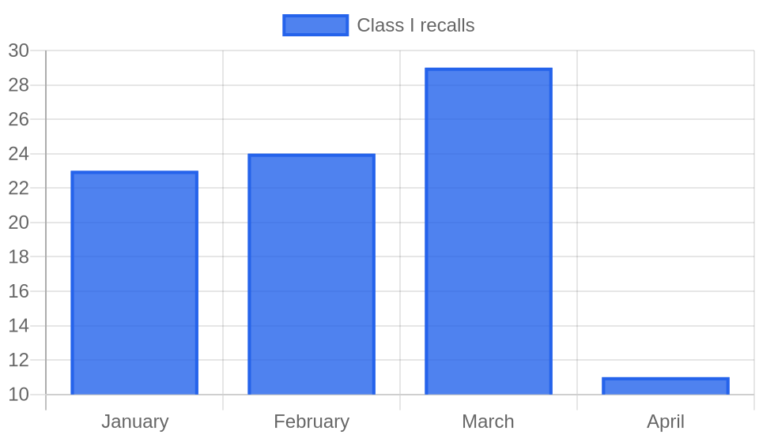

# Weekly FDA Roundup — May 23–29, 2026 (DRAFT for review)

> [!NOTE]
> Backfill draft, not published. Cover image, chart, and article below. Backdates to 2026-05-29 at publish.

**Headline:** Weekly FDA Roundup: one tainted dairy ingredient drives 36 Class I recalls, two supplement makers face botulism scares, and Insulet pulls 7 million insulin pods, May 23–29, 2026

**Slug:** `weekly-fda-roundup-2026-05-23`  ·  **Words:** 1245  ·  **Lead:** California Dairies Salmonella milk powder recall cascade

---

The biggest FDA story this week is not a new rule or a bold approval. It is a bag of powdered milk. Of the 38 Class I recalls the agency logged, at least 36 trace back to a single contaminated ingredient: Salmonella-tainted nonfat dry milk powder from California Dairies, Inc. The names on the recalled products range from Ghirardelli cocoa mixes to Squirrel Brand trail mix, but the source is the same, and it has been spreading since April.

## By the numbers

- **114 total FDA actions** tracked for the week of May 23 to 29.
- **38 Class I recalls**, the agency's most serious category. At least 36 are downstream products of one contaminated milk powder.
- **28 Class II recalls**, including two large clusters of dietary supplements pulled over botulism risk.
- **9 warning letters**, split across drug CGMP, food safety, and unapproved-drug marketing.
- **7 public safety alerts** for sexual-enhancement supplements spiked with hidden drug ingredients.

## Lead story: one dairy ingredient, three dozen Class I recalls

On April 20, California Dairies, Inc. recalled powdered milk over potential Salmonella contamination. California Dairies is one of the largest dairy cooperatives in the country and supplies roughly 40 percent of the U.S. market for dried milk powder, so the ingredient sits inside an enormous range of finished foods. This week the downstream damage landed in FDA's enforcement report all at once.

The pattern is consistent across every recall notice. Solina U.S. Holding pulled 10 Class I seasoning blends, from Cheddar Cheese Powder to Instant Country Gravy. Ghirardelli Chocolate Company pulled 10, mostly Perfectly Premium Frappe mixes and hot cocoa. John B. Sanfilippo & Sons pulled six trail and snack mixes under the Squirrel Brand, Southern Style Nuts, Fisher, and Good & Gather labels. PS Seasoning & Spices pulled six, including a one-pound package of Non Fat Dry Milk sold directly to consumers. Fontana Flavors recalled three cheese-flavor concentrates sold for further processing, and Pork King Good recalled its Onion & Sour Cream Seasoning. Each notice says the same thing: the product was made with milk powder that the supplier later recalled for Salmonella.

Why it matters: this is a textbook supplier-contamination cascade, where one bad lot of a shared ingredient contaminates dozens of unrelated brands that never dealt with each other. FDA has designated the overall event a Major Product Recall, a label it reserves for recalls with broad public-health scope. For any company that buys dairy powder, cheese powder, or seasoning blends, the exposure is not whether your own plant is clean. It is whether you know, by name and by lot, which ingredient supplier sits three tiers up your bill of materials. The cascade is also still growing. On May 29, Champion Foods recalled batches of Motor City Pizza Co. 5 Cheese Bread after tracing the same California Dairies milk powder into its seasoning blend.

## Key developments

### Two supplement makers pulled 27 products over botulism risk
Separate from the dairy story, the week produced two large Class II supplement recalls, both tied to Clostridium botulinum. Wellnov Supplements recalled 14 liposomal liquid products, including multivitamin drops, D3 and B12 sprays, and a sleep spray, over cGMP deviations that could allow bacterial contamination. Liquid Blenz Corp recalled 13 tonics and bitters sold under the "Bully" line, including Prostate Bully, Blood Pressure Bully, and Diabetes Bully, because under-processing created a risk of C. botulinum growth. Several of those products also carried disease claims on the label, which makes them unapproved drugs on top of the contamination problem. Botulism from a liquid supplement is rare, but it is the kind of hazard that turns a small firm's process shortcut into a life-threatening exposure. Anyone co-packing shelf-stable liquid supplements should read both recalls as a warning about validated thermal processing.

### Insulet, Abiomed, and Arrow: three device recalls with deaths in the record
Devices produced the week's most severe individual actions. Insulet issued a correction for certain Omnipod 5, Omnipod DASH, and Omnipod Eros pods after finding a small tear in the cannula tubing that can cause insulin to leak and under-deliver, risking high blood glucose and diabetic ketoacidosis. Roughly 7 million pods are affected globally, with 24 reported serious adverse events. FDA issued an Early Alert on Abiomed's Impella CP heart pump, where units that miss design specifications can lose purge pressure and mechanical circulatory support; one death and three pump exchanges are already linked to the defect. And Arrow International recalled several chronic hemodialysis catheter kits built around a Merit Medical splittable sheath that can fail to split during the procedure, risking hemorrhage and embolization. FDA designated the Arrow action Class I.

### Moringa supplements have their own Salmonella thread
The dairy cascade was not the only Salmonella story. Mogo Moringa recalled two lots of moringa capsules, and Total Nutrition recalled TNVitamins and Doctor's Pride moringa capsules sold nationwide through Amazon, Walmart, TikTok Shop, and Target. Both cite an FDA and CDC investigation into Salmonella in moringa-containing supplements. This is a distinct source from the milk powder, and it is worth watching as a second active pathogen investigation running in parallel.

### FDA reopens the door to pulling four solvents from food
On the policy side, FDA reopened comment periods on two petitions from the Environmental Defense Fund and co-signers. One asks the agency to amend the food additive rules to bar benzene, ethylene dichloride, methylene chloride, and trichloroethylene as solvents. The companion color-additive petition targets ethylene dichloride, methylene chloride, and trichloroethylene. These are legacy solvents, and reopening the comment window signals FDA is willing to revisit older authorizations that would struggle to win approval today.

### Two foreign drug plants drew CGMP warning letters
FDA posted warning letters to Alchymars ICM SM Private Limited, an active pharmaceutical ingredient maker in Tamil Nadu, India, and Sato Pharmaceutical Co., Ltd. in Tokyo. Alchymars drew citations for cracked gaskets, rust-like residues, and water dripping onto production floors, and FDA placed its drugs on Import Alert 66-40 on May 19. Sato was cited for repeated media fill failures on its sterile OTC filling line and for releasing product to the U.S. without required Burkholderia cepacia testing. Both letters follow the agency's continued focus on imported drug quality.

## The bigger picture

A single week produced 38 Class I recalls, more than any full month from January through April. The chart below is not a sign that the food supply suddenly got 38 times more dangerous in seven days. It is what a supplier-contamination cascade looks like when it hits the enforcement report: one bad ingredient, counted once per finished product, per brand, per package size. The lesson for regulated companies is that recall risk increasingly lives in the supply chain rather than in your own four walls.

## What to watch

- **California Dairies cascade.** Champion Foods was added May 29. Expect more downstream brands as manufacturers finish tracing lots.
- **Moringa Salmonella investigation.** An active FDA and CDC inquiry that may pull in more brands.
- **Food traceability.** FDA's public meeting on lot-level traceability is taking comments through July 15, 2026, directly relevant to how fast cascades like this one get contained.
- **EDF solvent petitions.** Comment windows on the food and color additive petitions are open now.
- **Oncology animal-testing guidance.** FDA's draft guidance on streamlined nonclinical safety studies is open for comment through July 30, 2026.

*Policy Canary tracks every FDA action, warning letters, recalls, guidance, and rules, against the specific products you make, by name and by ingredient. [See what we would flag for your products](https://policycanary.io).*
