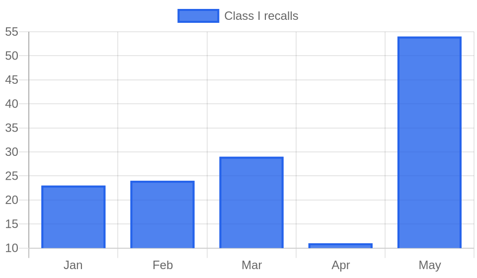

# Weekly FDA Roundup — June 6–12, 2026 (DRAFT for review)

> [!NOTE]
> Backfill draft, not published. Cover image, chart, and article below. Backdates to 2026-06-12 at publish.

**Headline:** Weekly FDA Roundup: 22 Class I recalls, an infant formula toxin, and a new sunscreen ingredient, June 6–12, 2026

**Slug:** `weekly-fda-roundup-2026-06-06`  ·  **Words:** 1295  ·  **Lead:** a2 Platinum infant formula Class I recall over cereulide toxin

---

FDA classified 22 recalls as Class I this week, its most serious category. For context, the agency logged 54 Class I recalls in all of May. One week in June produced nearly half that number, and almost all of it came from food.

## By the numbers

- 76 discrete FDA actions tracked across all sectors, June 6 to 12
- 14 warning letters, all posted June 9
- 22 Class I recalls, the most severe category
- 13 Class II recalls
- Standout items: an a2 Platinum infant formula recall over cereulide toxin, and a 10-product Salmonella recall from a single seasoning maker

## Lead story: An infant formula recall over a toxin hot water cannot destroy

The a2 Milk Company recalled a2 Platinum Premium infant formula, milk-based powder with iron, in 900g cans, after testing detected cereulide. FDA classified the recall Class I on June 10. Cereulide is a heat-stable toxin produced by some strains of Bacillus cereus, and that heat-stability is the reason this recall matters more than a routine contamination notice: preparing the bottle with hot water, the standard advice for reconstituting powdered formula, does not destroy it. a2 pulled three batches totaling 63,078 units, of which roughly 16,428 had already reached consumers. No illnesses have been confirmed. Symptoms of cereulide exposure appear within 30 minutes to six hours and usually involve vomiting that resolves on its own, but infants dehydrate quickly and can need medical care. a2 says it found the toxin through additional testing prompted by new guidance from New Zealand's food regulator, and that the probable source is an ingredient rather than its own process. Any parent using this specific product should check the batch, but every powdered-formula and dairy-ingredient maker should pay attention too, because cereulide is not on most routine pathogen panels. It is a chemical toxin left behind by bacteria that may no longer be present, which means a clean microbial test can still miss it.

## Key developments

### A dry milk powder problem rippled across seasonings and sauces

The week's Class I count was inflated by two food clusters that look related. JCB Flavors of Watertown, Wisconsin recalled ten seasoning products for Salmonella, from Butter Parsley and Ranch to Fiery Hot and White Cheddar, in sizes running from retail shakers to 50-pound bulk bags. The Coffee Connexion recalled four sauce products, including Alfredo Sauce and an Aramark-branded cheese sauce, and its notice traces the Salmonella to a dry milk powder ingredient from a supplier. Guittard Chocolate Company recalled 72% Cacao wafers over Salmonella the same day. Dairy powder is a shared thread worth watching, because one contaminated lot of dry milk can seed products from unrelated manufacturers. When a Salmonella problem surfaces in a seasoning maker, a sauce maker, and a bulk foodservice line in the same week, the recall list usually is not finished.

### Fourteen warning letters, and the recurring theme is carcinogen testing

FDA posted 14 warning letters on June 9, most for CGMP violations at drug manufacturers. Two stand out for the same failure. Zydus Lifesciences, at an Indian prescription-drug plant, was cited for data integrity problems: inspectors found the firm failed to run infrared testing to detect a known human carcinogen in a component, and that its quality unit deleted out-of-specification results and replaced them with passing ones. Revlon Group Holdings drew a letter for its Oxford, North Carolina OTC drug facility over failure to test incoming components for identity and for carcinogenic contaminants. The through-line is nitrosamine and impurity control, an enforcement priority that has been building for two years. When the quality unit is the thing that failed, FDA reads it as a systemic problem rather than a one-off.

### Sunscreen gets its first new active ingredient in two decades

FDA finalized an administrative order adding bemotrizinol as a GRASE active ingredient in the OTC sunscreen monograph, at concentrations up to 6%. It is the first new sunscreen active the US has permitted in more than 20 years, cleared through the streamlined order process the CARES Act created. Bemotrizinol is a broad-spectrum UVA and UVB filter already common in Europe. The agency paired the announcement with a notice of availability amending OTC Monograph M020, which governs sunscreen formulation, labeling, and testing. Companies can begin putting bemotrizinol into US products starting August 9. For formulators this reopens a category that has been frozen for a generation, and it is the clearest signal yet that the monograph order pathway can move ingredients the old rulemaking process left stranded.

### Medline convenience kits, again

Medline Industries issued a correction for convenience kits containing Huons Bupivacaine Hydrochloride in Dextrose Injection, after the drug's maker, Huons Co., recalled the component over quality problems found during an FDA inspection. Medline told users to quarantine the kits and over-label them to discard the bupivacaine before use. We keep flagging Medline convenience-kit corrections, and the pattern is consistent: a defective or recalled component from a third party sweeps up every kit it was packed into. Two other device actions landed the same week. BD recalled lots of ChloraPrep and FREPP skin-prep applicators over possible Aspergillus contamination that could cause systemic infection, and Abiomed issued a correction for its automated Impella heart-pump controllers. None of the three is a headline on its own, but together they are the steady background hum of device-side risk.

### FDA cleared a kids' glucose monitor and authorized a screwworm treatment

Two smaller approvals show FDA widening OTC access. The agency cleared Dexcom's Stelo Glucose Biosensor System as the first over-the-counter continuous glucose monitor for children aged two and older who do not use insulin, extending an adult clearance from 2024 and leaning on real-world evidence to do it. Separately, FDA issued an Emergency Use Authorization for generic nitenpyram tablets to treat New World screwworm infestations in dogs and cats, the first generic animal drug authorized for that use. The screwworm authorization is a response to the parasite's northward spread, and it is an unusual reach for the OTC animal-drug shelf.

## The bigger picture

Strip out the infant formula and the device corrections and this was, at its core, a food-safety week. The 22 Class I recalls sit against a backdrop that has been climbing all year, with a sharp jump in May. Some of that is real, driven by shared-ingredient contamination like the dry milk powder thread, and some is FDA working through a classification backlog. Either way, the trend line matters for anyone in food or dietary supplements: the base rate of serious recalls is rising, and a single bad ingredient lot now propagates across more finished products than it used to.

## What to watch

- Dry milk powder trace: The Coffee Connexion tied its Salmonella to a supplier's dry milk powder. Watch for more downstream recalls from other buyers of that lot.
- Bemotrizinol becomes usable in products August 9, 2026. Expect reformulated sunscreens and new labeling questions under amended Monograph M020.
- alli orlistat: FDA approved new OTC labeling on June 10 warning of acute kidney injury and kidney stones. Retailers and private-label orlistat sellers will need to match it.
- Early breathing-device alerts from Hamilton Medical and Baxter could escalate to formal recalls.
- Two information-collection notices list a July 13, 2026 date for OMB review comments.

*Policy Canary tracks every FDA action, warning letters, recalls, guidance, and rules, against the specific products you make, by name and by ingredient. [See what we would flag for your products](https://policycanary.io).*
