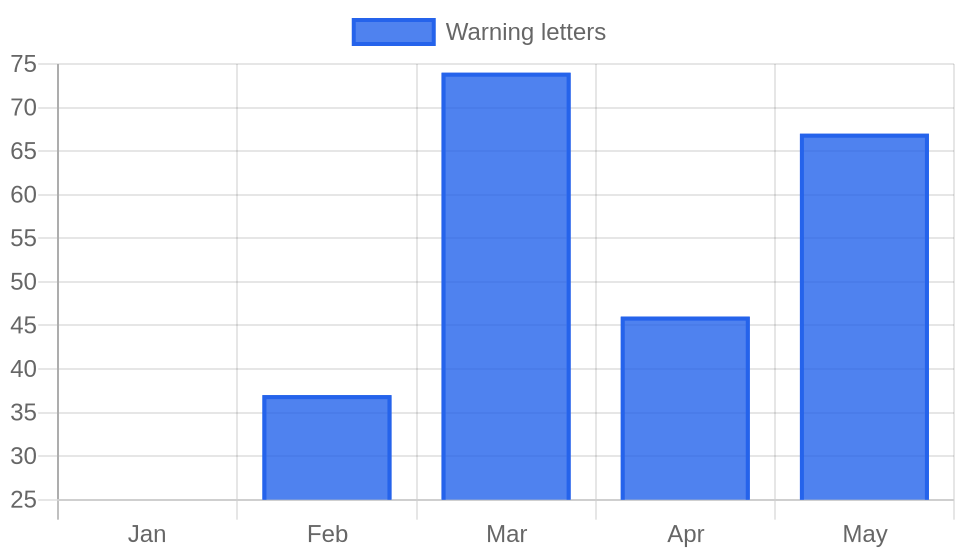

# Weekly FDA Roundup — June 20–26, 2026 (DRAFT for review)

> [!NOTE]
> Backfill draft, not published. Cover image, chart, and article below. Backdates to 2026-06-26 at publish.

**Headline:** Weekly FDA Roundup: Amazon gets a warning letter, three Class I food recalls, and a foreign tobacco crackdown, June 20–26, 2026

**Slug:** `weekly-fda-roundup-2026-06-20`  ·  **Words:** 1245  ·  **Lead:** FDA warning letter to Amazon for unapproved drugs sold via Fulfillment by Amazon

---

The biggest name FDA cited this week was not a supplement startup or an overseas factory. It was Amazon. On June 23 the agency posted a warning letter to Amazon.com, Inc. for distributing unapproved new drugs through its Fulfillment by Amazon network, and it was one of 20 warning letters FDA released that same day.

## By the numbers

- 76 FDA actions tracked from June 20 to June 26
- 20 warning letters, all posted June 23
- 18 recalls, including 3 Class I (FDA's most serious category)
- The 3 Class I recalls were all food: White Cheddar Seasoning (Jonco Industries), Al Yaman Halawa Extra Pistachio (GreenWorld Food Express), and Azuma Foods TAKO WASABI octopus
- 2 of the 20 warning letters hit sterile-injectable drug makers for CGMP violations: Jubilant HollisterStier and Huons Co., Ltd.

## Lead story: FDA puts Amazon itself on notice

FDA does not usually name the marketplace. It names the seller. This week it named the marketplace. The warning letter to Amazon.com, Inc. targets three products distributed through Fulfillment by Amazon and marketed to treat phimosis and balanitis, two penile conditions. The agency reviewed the labeling of products purchased through the site in May 2026 and concluded they are unapproved new drugs, because they carry disease-treatment claims without an approved application and without complying with the relevant OTC monograph. Outside reporting identifies the three products as Vajraang Phimosis Mini Combo, Penile Heal Cream, and Beilloso Balanitis Relief Cream, and dates the letter itself to June 17.

The reason this matters goes past the products. FDA is treating the fulfillment operator as a distributor of the drugs it warehouses and ships, not as a neutral pipe. Regulatory trade press framed the day the same way, reporting that FDA cited Amazon and other online sellers for unapproved drugs while separately citing drug manufacturers for CGMP failures. Amazon has 15 business days to describe its corrective actions.

Amazon was not alone on the list. The same June 23 batch hit Leading Edge Health, Inc. over its Erectin Stimulating Gel and VigRX Delay Wipes, Wholesale Peptide over injectable peptides, and roughly a dozen mostly overseas online sellers of unapproved drugs. Read together, the 20 letters are one message aimed at the online drug supply chain, and Amazon is the part of that chain with a household name.

## Key developments

### Three Class I food recalls, all traced to what was inside the package

Every Class I recall this week was food, and each one came down to an ingredient or an undeclared allergen. Fireworks Popcorn, a division of Jonco Industries, recalled multiple configurations of White Cheddar Seasoning, including gift sets sold under the Fireworks Popcorn and Williams Sonoma brands, after Salmonella turned up in the milk powder used to make it. GreenWorld Food Express recalled Al Yaman Halawa Extra Pistachio in 907g jars over potential Salmonella. Azuma Foods International recalled its TAKO WASABI Seasoned Octopus because the product contains undeclared fish. That contaminated-milk-powder thread ran wider than the one popcorn recall: the same week, International Food Products Corporation issued Class II recalls on several dairy powders, and Dkiru's Adndale Magnesium Glycinate Gummies were pulled for undeclared melatonin. Ingredient-level problems in one supplier show up in a lot of finished products at once.

### The peptide thread from April is still live

One of the 20 warning letters went to Wholesale Peptide for marketing injectable "Prostamax" and "Gonadorelin" as unapproved new drugs. The products were labeled "research use only," but the product pages claimed to treat benign prostatic hyperplasia, prostatitis, and prostate cancer. FDA gave the company 15 business days to submit a corrective action plan. This is the same legal argument we covered in April, when FDA posted seven warning letters in a single day against peptide sellers hiding GLP-1 copycats behind "research use only" disclaimers. The label does not control the classification. The claims do. Two months later, the agency is still working down the list.

### Two sterile-injectable makers cited for CGMP

The most serious drug-quality actions this week were two of the 20 warning letters. Jubilant HollisterStier General Partnership was cited for aseptic processing failures in its sterile finished-drug operations, including mold recoveries on personnel in ISO 5 cleanroom zones and visible particulate contamination in drug batches it did not properly investigate. Huons Co., Ltd., a South Korean manufacturer, drew a harsher set of findings: discarded failing bioburden plates, backdated records, and contamination hazards in aseptic processing. FDA placed Huons on Import Alert 66-40, and the firm suspended U.S. production. Sterile injectables carry the highest CGMP stakes, because a contamination escape reaches a patient's bloodstream directly.

### FDA moves to hold foreign tobacco makers to domestic rules

On June 26 FDA proposed a rule requiring foreign tobacco product manufacturers to register their establishments and list every product intended for the U.S. market, the same obligations domestic firms already carry. For e-cigarettes, the rule would require detailed product data including nicotine concentration, flavoring, and device specifications, plus four years of recordkeeping on advertising and labeling. The comment period runs to September 14, 2026. The gap this closes is real: much of the illegal disposable-vape market ships from overseas, and FDA has struggled to see who is making what.

### A cluster of drug-development guidances

FDA also pushed out a batch of trial-design guidance on June 24. There is a draft on Master Protocols for drug and biological product development (comments due August 24), a draft on Quantitative Systems Pharmacology-based dose selection (comments due July 24), and a revised guidance on Demonstrating Substantial Evidence of Effectiveness (comments due September 22). Separately, Epizyme's NDA for TAZVERIK (tazemetostat) 200 mg tablets was withdrawn, removing the legal authorization to market that product.

## The bigger picture

A 20-letter day is not noise. Warning-letter output has been climbing all year, from 25 in January to 74 in March and 67 in May, and the June 23 batch keeps that pace up while widening the aim to the platforms that host and ship the products. The through-line across peptides, penile creams, and dietary supplements is the same: a disclaimer on the page does not change what FDA reads the claims to be. Companies that count on "research use only" or a marketplace's distance from the seller are relying on a defense the agency has now rejected in writing several times this year.

## What to watch

- Amazon and the other 19 recipients have 15 business days from receipt to respond, which puts their replies in mid-July.
- Comments on the foreign tobacco manufacturer registration rule close September 14, 2026.
- Comments on the Master Protocols draft guidance close August 24, and on the QSP dose-selection guidance July 24.
- Whether the peptide enforcement wave that started in April keeps expanding to new vendors, as it did with Wholesale Peptide this week.
- Follow-through on Huons Co.: an Import Alert 66-40 listing keeps its products out of the U.S. until the data-integrity findings are resolved.

*Policy Canary tracks every FDA action, warning letters, recalls, guidance, and rules, against the specific products you make, by name and by ingredient. [See what we would flag for your products](https://policycanary.io).*
