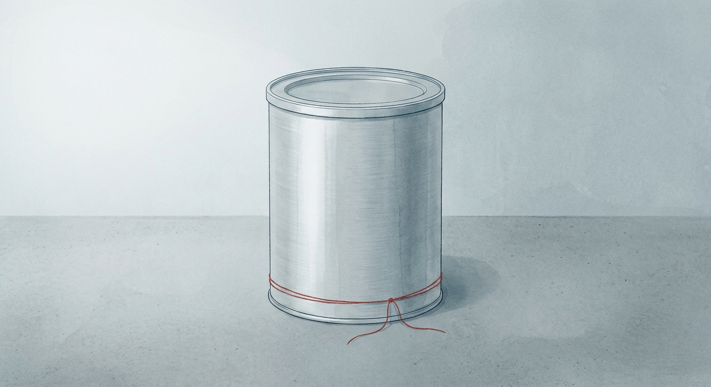

# Weekly FDA Roundup — July 4–10, 2026 (DRAFT for review)

> [!NOTE]
> Backfill draft, not published. Cover image, chart, and article below. Backdates to 2026-07-10 at publish.

**Headline:** Weekly FDA Roundup: botulism in infant formula, a ketamine warning-letter sweep, and a growing convenience-kit thread, July 4–10, 2026

**Slug:** `weekly-fda-roundup-2026-07-04`  ·  **Words:** 1224  ·  **Lead:** Class I recall of Nara Organics infant formula over Clostridium botulinum

---

The most serious thing FDA did this week is about a can of baby formula. On July 8 the agency logged a Class I recall, its most serious category, for Nara Organics Whole Milk Organic Infant Formula over potential contamination with Clostridium botulinum, the bacterium that causes botulism. It caps an outbreak investigation that FDA and CDC updated two days earlier to four confirmed cases of infant botulism.

## By the numbers

- **44 FDA actions** logged July 4 through 10, spanning food, drugs, devices, and supplements.
- **18 warning letters**, 15 of them to online sellers of unapproved drugs, most peddling ketamine.
- **3 Class I food and supplement recalls**: Nara Organics (infant formula, botulism), Western Mixers Produce & Nuts (undeclared peanuts), and MOGO Moringa (Salmonella).
- **3 Class I device and convenience-kit actions**: Windstone Medical, Fresenius Kabi Ivenix infusion pumps, and an FDA early alert on Medline kits.
- **1 proposed rule** to modernize drug manufacturing registration, alongside the withdrawal of 34 Endo new drug applications.

## Lead story: A botulism outbreak traced to organic infant formula

Nara Organics of New York recalled all lots of its Whole Milk Organic Infant Formula, a milk-based powder with iron sold for infants 0 to 12 months, and FDA carried that recall as Class I on July 8. The trigger is potential contamination with Clostridium botulinum. Two days earlier, on July 6, FDA and CDC updated their joint outbreak investigation to four confirmed cases of infant botulism, all boys who fell ill between April and May 2026, ranging from roughly 68 to 153 days old, in California (two cases), Pennsylvania, and Washington. No deaths have been reported. Laboratory testing confirmed C. botulinum in an opened can of the formula that had been fed to one of the affected infants, which moves this from a suspected link to a sourced one.

The recall covers all Nara Organics formula sold nationwide, including at Target, Target.com, and Nara.com, between July 2025 and June 2026. Powdered infant formula is not a sterile product, and it is the single most sensitive category FDA regulates, fed to the people least able to tolerate a pathogen. Infant botulism is rare and severe, and a confirmed pathogen in an open can that a sick baby drank is the kind of evidence that ends the question of whether a recall is warranted.

Anyone who makes, co-packs, or supplies ingredients for infant formula should be reading the eventual root-cause findings closely. The practical question is where the spores entered: raw dairy inputs, the drying and blending line, or post-process handling. Until FDA and the company answer that, this is a live outbreak, not a closed recall.

## Key developments

### FDA hits 15 online drug sellers in one day, most selling ketamine

On July 7 the agency posted 18 warning letters at once. Fifteen went to online sellers of unapproved, misbranded drugs, and most of those were ketamine vendors: Ket Plug, Ketacyn Pharmaceuticals, All Ketamine HCL, Ketamine Troche Store, Legit Ketamine Suppliers, Buy Keta Online, and Pure Arylcyclohexylamine Store, among others. The pattern repeats site to site. Vendors sell ketamine powder, troches, or injectables, sometimes labeled "for research and scientific use," while marketing them for depression and similar conditions. FDA's Center for Drug Evaluation and Research treats that as an unapproved new drug and a prescription drug without adequate directions for lay use. The agency asked each seller to stop sales to US consumers immediately, citing the risk of unsupervised ketamine use. Fifteen letters in a single day is not routine cleanup. It is a coordinated sweep against a specific corner of the direct-to-consumer drug market.

### The Medline convenience-kit thread keeps growing

On July 9 FDA issued an early alert on Medline convenience kits that contain recalled BD ChloraPrep Clear 1 mL and FREPP Clear 1.5 mL applicators. Becton Dickinson initiated that recall over packaging defects, wrinkles in the paper lidding, that can compromise the sterile barrier and expose patients to microbial contamination. Users are told to pull the affected applicators and over-label the kits. This lands three days after Windstone Medical Packaging issued its own Class I recall on July 6, for surgical and diagnostic convenience kits (including DSAEK and Thyroid FNA packs) built around Cardinal Health Webcol alcohol prep pads contaminated with Paenibacillus phoenicis. Two different kit assemblers, two different contaminated components, one recurring problem: a single defective part inside a bundled kit drags the whole kit off the market. We have flagged this convenience-kit dynamic in prior roundups, and it is still surfacing in new kits from new manufacturers.

### Two more Class I food recalls: peanuts and Salmonella

Beyond the infant formula, two more Class I recalls landed on July 8. Western Mixers Produce & Nuts recalled FIRST STREET Dark Chocolate Raisins (9 oz.) over undeclared peanuts, a major allergen that can be fatal to a sensitized consumer who has no reason to expect it in a raisin package. Separately, MOGO Moringa recalled its MOGO Pure Moringa Oleifera Capsules (180-count, 350 mg) over potential Salmonella Typhimurium contamination in a product sold as 100% pure moringa leaf powder. Undeclared allergens and Salmonella remain the two most common reasons a food or supplement reaches Class I, and both showed up in the same day's enforcement report.

### A pump that lies about its own battery

Fresenius Kabi issued a Class I correction for its Ivenix Large Volume Infusion Pump (LVP-0004) running software version 5.10.2. A software anomaly reports false battery-health values, often a reading of 69%, and can trigger a battery-depletion shutdown mid-infusion. For a patient on a critical or short half-life medication, an unexpected pump stop is a direct clinical hazard. Fresenius told users to keep the pumps connected to AC power at all times until a software update ships, expected in July 2026, and FDA lists a July 31 response date for the correction. This is a good reminder that a device recall is not always about hardware. Here the metal is fine and the code is the defect.

### FDA wants a clearer view of the drug supply chain

On July 10 FDA proposed a rule to modernize drug manufacturing registration. It would let distributed "hub-and-spoke" manufacturing sites register as a single entity rather than unit by unit, and it would require certain foreign makers of drugs and active pharmaceutical ingredients to register when their products indirectly enter the US supply chain. The aim is to close transparency gaps upstream, where FDA today often cannot see who is actually making an ingredient two or three steps back. The same week, the agency formally withdrew approval of 34 new drug applications held by Endo Operations and others, removing the legal basis to market those products.

## The bigger picture

Class I recall volume has run high and uneven all year. After a quiet April (11 Class I recalls), the count jumped to 54 in May and stayed elevated at 37 in June. This week's six Class I actions, three in food and supplements and three in devices and kits, fit that elevated baseline rather than breaking from it. The signal is not a single bad week but a sustained pace of serious recalls across every category FDA touches.

## What to watch

- Fresenius Kabi customers need to confirm and implement the Ivenix correction; FDA lists a July 31, 2026 response date.
- Comment on the two OMB information-collection notices closes August 5, 2026; the biologics licensing collection closes September 4, 2026.
- Whether more Medline or BD-sourced kits surface with the same ChloraPrep and FREPP applicator lots.
- The Nara Organics outbreak count. Four cases were confirmed as of July 6 and the investigation is open, so root-cause findings and any expansion are the next shoe to drop.
- The comment window on the drug manufacturing registration proposed rule once it publishes in the Federal Register.

*Policy Canary tracks every FDA action, warning letters, recalls, guidance, and rules, against the specific products you make, by name and by ingredient. [See what we would flag for your products](https://policycanary.io).*
