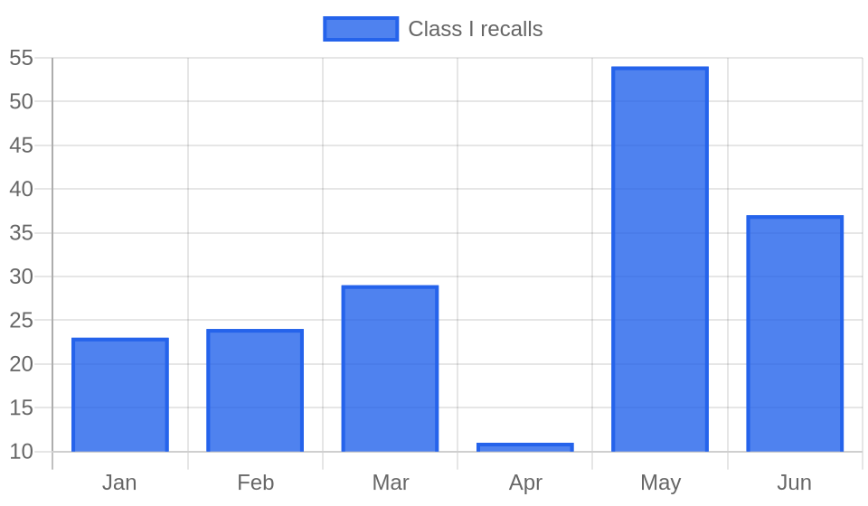

# Weekly FDA Roundup — July 18–24, 2026 (DRAFT for review)

> [!NOTE]
> Backfill draft, not published. Cover image, chart, and article below. Backdates to 2026-07-24 at publish.

**Headline:** Weekly FDA Roundup: a 16-flavor ice pop recall, a food-dye cleanup, and 15 warning letters, July 18–24, 2026

**Slug:** `weekly-fda-roundup-2026-07-18`  ·  **Words:** 1268  ·  **Lead:** D'Dioses ice pop Class I allergen recall

---

The most serious food recall FDA handled this week was a box of frozen ice pops. On July 22 the agency classified as Class I, its highest risk level, a recall covering 16 flavors of D'Dioses paletas, 57,240 units in all, over undeclared milk, pecans, pistachios, and two color dyes. That single event accounted for most of the week's top-tier recalls, and it set the theme: labels, not molecules, drove the week's highest-risk actions.

## By the numbers

- **72 FDA actions** posted July 18–24, across food, pharma, devices, cosmetics, and tobacco.
- **15 warning letters**, weighted toward pharmaceutical CGMP and imported-food supplier violations.
- **17 Class I recall entries**: 16 D'Dioses ice pop flavors plus one organic blueberry recall over E. coli O145:H28.
- **9 Class II food recalls**, from Amy's Kitchen soup to General Mills Pillsbury roll dough.
- **Standout:** FDA revoked Orange B and proposed revoking Citrus Red No. 2, and Midwest Poultry recalled more than 1.5 million dozen eggs over Salmonella.

## Lead story: A 16-flavor ice pop recall gets FDA's highest risk level

De Dios's Ice Pops II LLC, which sells under the D'Dioses brand, recalled 57,240 paletas across 16 flavors because the products may contain undeclared milk, pecans, pistachios, Yellow #5, and Red #40. FDA put the recall in Class I, meaning consumption can cause serious or life-threatening allergic reactions in people sensitive to those ingredients. Milk, tree nuts, and certified color additives all trigger labeling requirements, and none of these were declared.

The affected flavors span the full D'Dioses line, from Nanche and Mamey to Pistachio, Cookies Cream, and Arroz con Leche. Distribution was regional: retail grocery stores in New Jersey, New York, Pennsylvania, and Connecticut. The recall covers all units produced before April 27, 2026. The company says product made after that date runs through new, FDA-verified allergen controls and is not affected.

The root cause is manufacturing, not formulation. An FDA inspection found that the plant's existing processes needed improvement to prevent allergen cross-contact, so an allergen from one product line ended up in others without appearing on the label. No illnesses have been reported so far.

Anyone who makes multi-flavor, multi-ingredient products in shared equipment should read this one closely. Undeclared allergens are the single most common cause of Class I food recalls, and they rarely come from a bad recipe. They come from a shared scoop, a reworked batch, or a pistachio flavor running on the same line as a plain one. The dyes matter too: Yellow #5 (tartrazine) and Red #40 carry their own declaration rules, and this recall folds them in alongside the milk and nuts.

## Key developments

### FDA revoked one petroleum food dye and moved to kill another

On July 22 FDA issued a final order revoking the authorized use of Orange B, the dye once permitted on the casings and surfaces of hot dogs and sausages. The agency says industry abandoned the color and it received nothing to change that conclusion. The same day it proposed revoking Citrus Red No. 2, authorized since 1959 for coloring the skins of mature oranges. The Citrus Red No. 2 proposal carries a 30-day comment window that closes August 24, 2026. Both moves ran as separate Federal Register entries this week, a proposed rule for Citrus Red No. 2 and a final rule for Orange B. This continues the agency's methodical phase-out of petroleum-based color additives, and it is the third color-additive item to cross the docket in a single week. The immediate industry impact is small because neither dye is in wide use, but the direction of travel is clear.

### Midwest Poultry recalled more than 1.5 million dozen eggs

Midwest Poultry Services, L.P. recalled over 1.5 million dozen white and brown cage-free shell eggs after environmental monitoring at its Texas farms flagged possible Salmonella Enteritidis. The eggs went to foodservice and retail, including Kroger and Brookshire Grocery locations across Texas, Oklahoma, Louisiana, Arkansas, New Mexico, and Mississippi. Shell-egg Salmonella recalls are a recurring FDA problem, and the volume here is what makes it notable: a seven-figure dozen count moving through two major grocery chains and the foodservice channel. The recall carries a use-by window running through August 17, 2026, so affected product is still in circulation.

### Boston Scientific catheter early alert, and a familiar name

FDA posted an Early Alert for the Boston Scientific ENROUTE Transcarotid Neuroprotection System and NPS Plus after reports of arterial sheath tip separation. A separated tip can cause embolism, stroke, transient ischemic attack, or thrombosis, and may require surgical retrieval. FDA flagged it as high-risk following at least one serious injury. An Early Alert is the agency's way of warning clinicians before a device recall is formally classified, so expect a Class I designation to follow. Boston Scientific is the same manufacturer behind the six-family pacemaker recall we covered in May. Two high-risk device actions from one maker in a single quarter is a pattern worth tracking.

### 15 warning letters, heavy on sterile drug manufacturing

The warning-letter batch leaned pharmaceutical. FDA cited Fareva Amboise, a French sterile-drug plant, for aseptic-processing failures, an operator-borne contaminant (Corynebacterium tuberculostearicum), and data-integrity gaps on its particle counters. API makers Shimoga Chemicals and Almon Healthcare drew CGMP letters, as did finished-drug maker BioMylz. Alembic Pharmaceuticals was cited for a bioequivalence study whose consent form misleadingly told subjects the study was not experimental. Four separate importers (Shang Hao Jia, Sanz Wholesale Foods, Balkanica, and Beauty Store) got Foreign Supplier Verification Program letters, and three UK vape retailers were warned under the Tobacco Control Act. One letter, to Island Kinetics dba CoValence Laboratories, straddles the cosmetics-drug line on CGMP and unapproved-drug grounds.

### A sexual-enhancement product hiding a prescription drug

FDA laboratory analysis found that "Kangaroo Intense Venus 3000," sold online through usroyalhoney.com and possibly in retail, contains undeclared sildenafil, the active ingredient in Viagra. Hidden sildenafil can interact with nitrates in prescription heart medications to drop blood pressure dangerously. This is a steady drumbeat in the supplement and "male enhancement" category, where hidden pharmaceutical ingredients turn a product marketed as natural into an unapproved drug. If you formulate or sell in this space, the enforcement risk is not hypothetical.

## The bigger picture

Undeclared allergens and pathogen contamination drove almost every Class I action this week, which fits the longer 2026 pattern. Class I recall volume has swung hard month to month this year, from a low of 11 in April to a spike of 54 in May. The D'Dioses recall is a textbook case of the most durable cause: allergen cross-contact on shared equipment, caught by an FDA inspection rather than a consumer complaint. The lesson for manufacturers is that your recall exposure often lives on the production line, not in the formula.

## What to watch

- **Citrus Red No. 2 comments close August 24, 2026.** Growers and citrus packers who color orange skins should weigh in before the window shuts.
- **Midwest Poultry eggs stay in circulation through August 17, 2026.** Watch for illness reports that could widen the recall.
- **Boston Scientific ENROUTE Early Alert.** Expect a formal Class I recall classification to follow the high-risk warning.
- **Sterile injectables are piling up.** American Regent (papaverine), Sunny Pharmtech (cyclophosphamide), and Baxter (cefazolin) all issued nationwide injectable recalls on July 24. A cluster like this can signal a shared upstream problem.
- **Expedited IND Pilot Program RFI comments due August 24, 2026** for drug sponsors tracking FDA's review-acceleration efforts.

*Policy Canary tracks every FDA action, warning letters, recalls, guidance, and rules, against the specific products you make, by name and by ingredient. [See what we would flag for your products](https://policycanary.io).*
