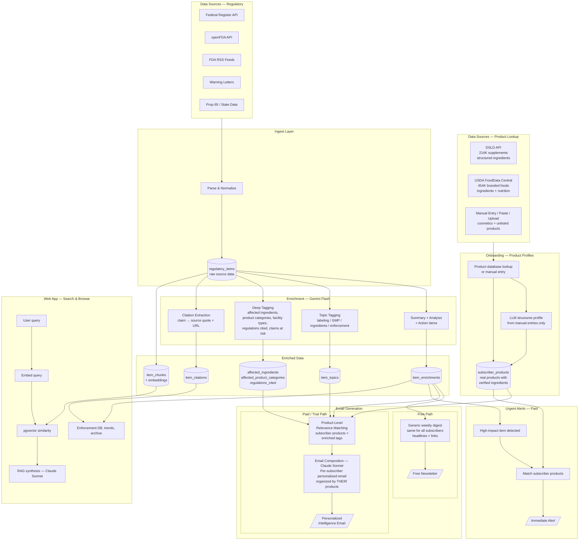
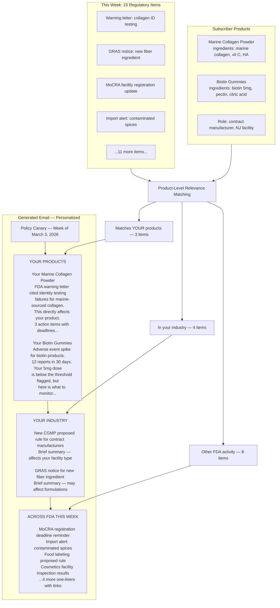
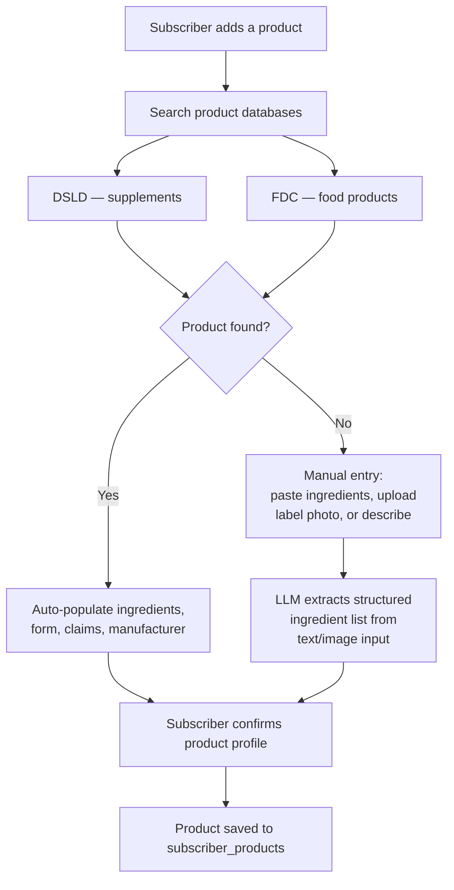

# LLM & Data Flow Architecture

## Product-Centric Model

The core unit is the subscriber's **actual products**. Product categories (~111 controlled slugs across 8 groups: cosmetics, food, supplements, pharma, devices, biologics, tobacco, veterinary) are used for classification in the data pipeline. The subscriber experience is organized around their real products and ingredients.

Onboarding collects real products via database lookup (DSLD for supplements, USDA FoodData Central for food) or manual entry (cosmetics, unlisted products). The system knows exactly what ingredients are in each product and matches regulatory items against them.

## 1. System Overview — End to End



## 2. Enrichment Detail — What the LLM Produces Per Item

**Pipeline steps per item:**
1. **Content-fetch** — if source_url points to FDA.gov and content is thin (<1K chars), fetch full page and extract `<main>` text. RSS items go from ~200 chars to 2K-7K chars.
2. **LLM extraction** — single Gemini call (Flash for simple items, Pro for complex). Produces all structured outputs below.
3. **Cross-reference inference** (BUILT + DATA LOADED) — Step 1b: deterministic lookup of extracted substances in GSRS `substance_codes` (949K codes, 96 systems) → maps 9 relevant systems to use-context categories. Step 1c: Gemini 2.5 Pro with thinking (budget: 4096) reasons about cross-category risk transfer. Only fires when use contexts reveal sectors beyond Step 1's direct extraction (~20-30% of items). `signal_source` column on `item_enrichment_tags` distinguishes direct vs inferred. See `src/pipeline/enrichment/cross-reference.ts`.
4. **Embeddings** — chunk content, generate OpenAI embeddings for vector search.

Full content is sent to the LLM — no truncation. Longest item is ~47K chars (~12K tokens), well within Gemini's 1M token context.

```mermaid
flowchart LR
    subgraph INPUT["Raw Regulatory Item"]
        TITLE[Title]
        BODY[Full Text / Abstract]
        SOURCE_META[Source metadata<br/>agency, type, dates]
    end

    subgraph LLM["Gemini Flash — Single Call"]
        direction TB
        PROMPT["Structured prompt requesting<br/>all outputs in one pass"]
    end

    subgraph OUTPUT["Enrichment Outputs"]
        direction TB
        O1["plain_english_summary"]
        O3["topics[]<br/>labeling, GMP, ingredients, enforcement"]
        O4["affected_ingredients[]<br/>marine collagen, ashwagandha, retinol..."]
        O5["affected_product_categories[]<br/>controlled slugs from product_categories"]
        O6["affected_facility_types[]<br/>manufacturer, packager, lab"]
        O7["affected_claims[]<br/>joint health, anti-aging..."]
        O9["action_items[]<br/>specific steps + deadlines"]
        O10["citations[]<br/>claim → source quote + URL"]
        O11["regulations_cited[]<br/>21 CFR 111.70, MoCRA §607"]
    end

    INPUT --> LLM --> OUTPUT
```



## 3. Email Structure — Paid Subscriber (Product-Centric)

Everything shows up. Items relevant to the subscriber's actual products get full analysis. Everything else gets a one-liner. Nothing is hidden or filtered out.



## 4. Onboarding — Product Collection

High-level flow. Specific UI is RB's design.

**Data sources for product lookup:**

| Group | Primary Source | Products | Key Data |
|---------|---------------|----------|----------|
| Supplements | DSLD (NIH) | 214,780 (121K on-market) | Structured ingredients with amounts, categories, UNII codes, claims, form, manufacturer |
| Food | USDA FoodData Central | 454,596 branded | Ingredients (text), nutrition data, UPC barcodes, brand |
| Cosmetics | Manual entry | N/A | Paste ingredients, upload label photo, or describe. No good public API exists yet. |

**DSLD API (supplements):**
- Base: `https://api.ods.od.nih.gov/dsld/v9/`
- No auth required, CORS open
- Search by product name, brand, ingredient
- Returns full structured ingredient list per product
- Rate limit: ~1,000 req/hour

**USDA FDC API (food):**
- Base: `https://api.nal.usda.gov/fdc/v1/`
- Free API key from data.gov
- Search by name or UPC barcode
- Returns ingredients (text string) + full nutrition
- Rate limit: ~1,000 req/hour

**Cosmetics gap:** MoCRA collected 589K product listings but FDA hasn't made them publicly searchable. EWG Skin Deep has 130K products but no API. For cosmetics, onboarding falls back to manual entry — paste ingredient list, upload a photo, or describe.



## 5. Content Automation — Clawdbot (OpenClaw)

Clawdbot is a live AI agent on a Vultr VPS that reads enriched data from Supabase and produces content for the blog and (future) LinkedIn. It runs Claude Sonnet via the OpenClaw gateway and communicates through Discord.

```
Supabase (enriched items)
    ↓ query-supabase.mjs
Clawdbot (Claude Sonnet via OpenClaw)
    ↓ drafts blog post
Discord #weekly-roundup (human review)
    ↓ "publish" command
publish-blog.mjs → POST /api/blog
    ↓
policycanary.io/blog (live)
```

**Current skills:** `weekly-roundup` (Fridays 9 AM ET)
**Future skills:** `wl-deep-dive`, `daily-scan`, `data-nugget`, LinkedIn drafts

## 6. LLM Usage Summary

| Layer | Model | When | Cost Driver |
|-------|-------|------|-------------|
| **Data Enrichment + Deep Tagging** | Gemini 2.5 Flash / Pro | At ingest (once per item, single call). Flash for simple items, Pro for complex (WLs, rules). | ~50-100 items/week |
| **Cross-Reference Inference (Step 1c)** | Gemini 2.5 Pro + thinking | After enrichment, when use contexts exist for resolved substances. Budget: 4096 thinking tokens. | ~$0.02/call, varies by item mix |
| **Content Automation (Clawdbot)** | Claude Sonnet 4.6 | Weekly roundup + ad-hoc content drafts via OpenClaw | ~1-4 calls/week |
| **Onboarding — manual entry parsing** | Claude Sonnet 4.6 | When product not found in database | Low — most supplements auto-populate from DSLD |
| **Email Composition** | Claude Sonnet 4.6 | Weekly per paid subscriber | Subscriber count × weekly |
| **Urgent Alert** | Claude Sonnet 4.6 | Per high-impact event × matched subscribers | Low frequency |
| **AI Search** | Claude Sonnet 4.6 | Per user query in web app | Usage-dependent |
| **Embeddings** | text-embedding-3-small | At ingest (chunked) | Volume of items |

## 7. Key Design Decisions

1. **Products are the core unit.** The email says "Your Marine Collagen Powder" not "This week in supplements." Product categories are the classification layer — sectors exist only as display metadata, not used in pipeline logic.

2. **Real product data from public databases.** DSLD for supplements (214K products, structured ingredients), USDA FDC for food (454K products). No guessing — verified ingredient lists pulled from authoritative sources.

3. **Cosmetics is the gap.** No good public product database exists. MoCRA data isn't public. Onboarding falls back to manual entry (paste/upload/describe) with LLM extraction.

4. **Everything shows up, nothing is hidden.** Paid emails show ALL items for the week. Items matching subscriber's products get full analysis. Same-industry items get a brief. Other FDA activity gets a one-liner + link.

5. **Free email is content marketing, not stripped product.** Same generic digest for everyone. No personalization. It's a newsletter that drives trial signups.

6. **Enrichment does the heavy lifting once.** Deep tagging (affected ingredients, product types, facility types, claims, regulations) happens at ingest. Email assembly matches those tags against subscriber product profiles.

7. **Three LLM providers, each for their strength.** Gemini for bulk data enrichment (cheap, fast). Claude for writing quality (emails, search). OpenAI for embeddings.

## 8. Product-Level Matching — How It Works

The enrichment layer tags each regulatory item with affected ingredients, product types, claims, etc. The subscriber has real products with verified ingredient lists. Matching is dimensional:

| Dimension | Enrichment Tags | Subscriber Product |
|-----------|----------------|--------------------|
| Ingredients | `[marine collagen, bovine collagen]` | `[marine collagen, vitamin C, HA]` |
| Product types | `[collagen supplements, protein powders]` | `[collagen powder]` |
| Claims | `[joint health, anti-aging]` | `[supports joint health]` |
| Facility types | `[manufacturer]` | `[contract manufacturer]` |
| Regulations | `[21 CFR 111.70]` | (tracked via product category) |

Match = intersection across any dimension. The more dimensions that match, the higher the relevance score. A regulatory item about "identity testing for marine collagen" hits on both ingredient AND product type for a subscriber with a marine collagen powder → critical relevance.
