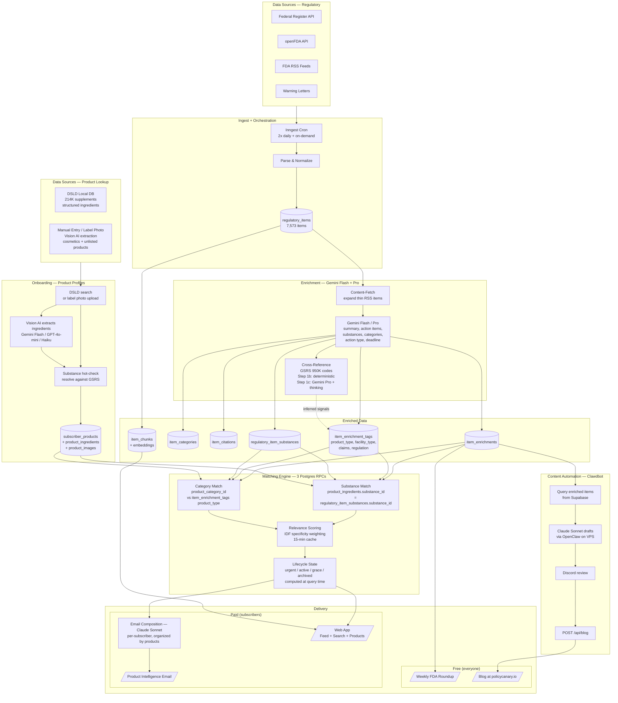
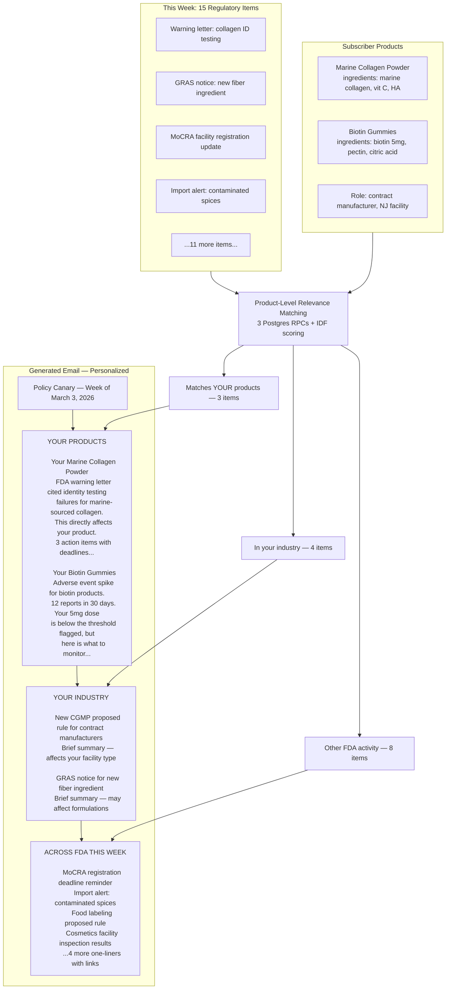
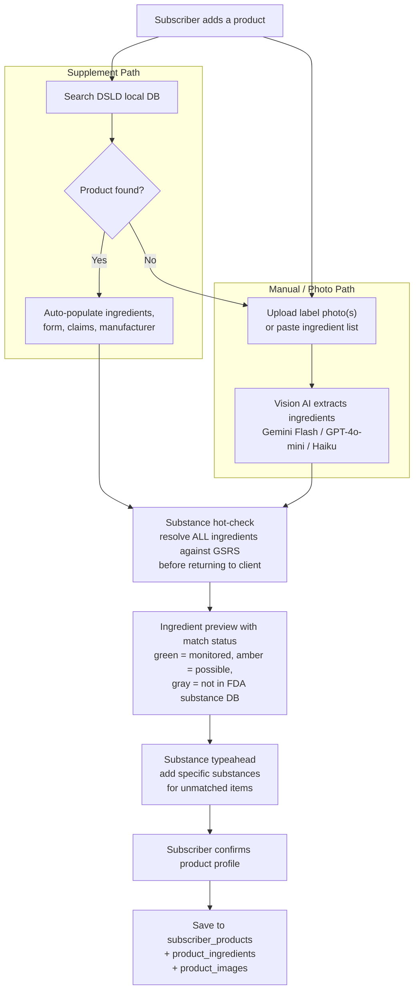

# LLM & Data Flow Architecture

## Product-Centric Model

The core unit is the subscriber's **actual products**. Product categories (~119 controlled slugs across 8 groups: cosmetics, food, supplements, pharma, devices, biologics, tobacco, veterinary) are used for classification in the data pipeline. The subscriber experience is organized around their real products and ingredients.

Onboarding collects real products via local database lookup (DSLD for supplements) or manual entry with Vision AI (cosmetics, unlisted products). The system knows exactly what ingredients are in each product and matches regulatory items against them.

## 1. System Overview — End to End



## 2. Enrichment Detail — What the LLM Produces Per Item

**Pipeline steps per item:**
1. **Content-fetch** — if source_url points to FDA.gov and content is thin (<1K chars), fetch full page and extract `<main>` text. RSS items go from ~200 chars to 2K-7K chars. No host allowlist — fetches any source URL from our fetchers.
2. **LLM extraction** — single Gemini call (Flash for simple items, Pro for complex). Produces all structured outputs below.
3. **Cross-reference inference** — Step 1b: deterministic lookup of extracted substances in GSRS `substance_codes` (949K codes, 96 systems) maps 9 relevant systems to use-context categories. Step 1c: Gemini 2.5 Pro with thinking (budget: 4096) reasons about cross-category risk transfer. Fires whenever use contexts exist for resolved substances. `signal_source` column on `item_enrichment_tags` distinguishes `direct` vs `cross_reference`. See `src/pipeline/enrichment/cross-reference.ts`.
4. **Embeddings** — chunk content, generate OpenAI embeddings for vector search.

Full content is sent to the LLM — no truncation. Longest item is ~47K chars (~12K tokens), well within Gemini's 1M token context.

```mermaid
flowchart LR
    subgraph INPUT["Raw Regulatory Item"]
        TITLE[Title]
        BODY[Full Text / Abstract]
        SOURCE_META[Source metadata<br/>agency, type, dates]
    end

    subgraph LLM["Gemini Flash / Pro — Single Call"]
        direction TB
        PROMPT["Structured prompt requesting<br/>all outputs in one pass"]
    end

    subgraph OUTPUT["Enrichment Outputs"]
        direction TB
        O1["plain_english_summary"]
        O2["regulatory_action_type<br/>recall, ban, compliance_req..."]
        O3["deadline (ISO date, if any)"]
        O4["affected_ingredients[]<br/>marine collagen, ashwagandha, retinol..."]
        O5["affected_product_categories[]<br/>119 controlled slugs from product_categories"]
        O6["affected_facility_types[]<br/>manufacturer, packager, lab"]
        O7["affected_claims[]<br/>joint health, anti-aging..."]
        O8["action_items[]<br/>specific steps + deadlines"]
        O9["citations[]<br/>claim + source quote + URL"]
        O10["regulations_cited[]<br/>21 CFR 111.70, MoCRA S607"]
    end

    INPUT --> LLM --> OUTPUT
```



## 3. Email Structure — Paid Subscriber (Product-Centric)

Everything shows up. Items relevant to the subscriber's actual products get full analysis. Everything else gets a one-liner. Nothing is hidden or filtered out.



## 4. Onboarding — Product Collection

**Data sources for product lookup:**

| Group | Primary Source | Products | Key Data |
|---------|---------------|----------|----------|
| Supplements | DSLD (local DB, bootstrapped from NIH) | 214,780 (121K on-market) | Structured ingredients with amounts, categories, UNII codes, claims, form, manufacturer |
| Food | USDA FoodData Central (deferred) | 454,596 branded | Ingredients (text), nutrition data, UPC barcodes, brand |
| Cosmetics | Manual entry + Vision AI | N/A | Upload label photo(s), paste ingredients, or describe. Vision AI extracts structured ingredients. |

**DSLD (supplements):** Local Postgres tables (`dsld_products`, `dsld_ingredients`, `dsld_other_ingredients`, `dsld_companies`, `dsld_label_statements`). 214K products bootstrapped via `scripts/bootstrap-dsld.ts`. ILIKE prefix search, pg_trgm index (~12ms). Refresh quarterly.

**USDA FDC (food):** Deferred. API available at `https://api.nal.usda.gov/fdc/v1/` with free key.

**Cosmetics gap:** MoCRA collected 589K product listings but FDA hasn't made them publicly searchable. For cosmetics, onboarding uses Vision AI — upload 1-5 label photos, AI extracts individual ingredients, substances resolved against GSRS before save.



## 5. Content Automation — Clawdbot (OpenClaw)

Clawdbot is a live AI agent on a Vultr VPS (`108.61.151.130`) that reads enriched data from Supabase and produces content for the blog. It runs Claude Sonnet via the OpenClaw gateway and communicates through Discord.

```
Supabase (enriched items)
    | query-supabase.mjs
Clawdbot (Claude Sonnet via OpenClaw)
    | drafts blog post
Discord (human review)
    | "publish" command
publish-blog.mjs -> POST /api/blog
    |
policycanary.io/blog (live)
```

**Current skills + cron:**
| Skill | Cron | Channel |
|-------|------|---------|
| `weekly-roundup` | Fridays 9 AM ET | `#weekly-roundup` |
| `seo-blog-post` | Tuesdays 10 AM ET | `#blog-drafts` |
| `seo-blog-post` | Thursdays 10 AM ET | `#blog-drafts` |

**Future skills:** `wl-deep-dive`, `daily-scan`, `data-nugget`, LinkedIn drafts

## 6. LLM Usage Summary

| Layer | Model | When | Cost Driver |
|-------|-------|------|-------------|
| **Data Enrichment** | Gemini 2.5 Flash / Pro | At ingest (once per item, single call). Flash for simple, Pro for complex. | ~50-100 items/week |
| **Cross-Reference (Step 1c)** | Gemini 2.5 Pro + thinking | After enrichment, when use contexts exist. Budget: 4096 thinking tokens. | ~$0.02/call |
| **Content Automation** | Claude Sonnet 4.6 | Weekly roundup + SEO blog posts (3x/week) via OpenClaw | ~3-5 calls/week |
| **Onboarding — Vision AI** | Gemini 2.5 Flash (primary), GPT-4o-mini, Claude Haiku (fallbacks) | When subscriber uploads label photo(s) | Low — supplements auto-populate from DSLD |
| **Email Composition** | Claude Sonnet 4.6 | Weekly per paid subscriber | Subscriber count x weekly |
| **Urgent Alert** | Claude Sonnet 4.6 | Per high-impact event x matched subscribers | Low frequency |
| **AI Search** | Claude Sonnet 4.6 | Per user query in web app | Usage-dependent |
| **Embeddings** | text-embedding-3-small | At ingest (chunked) | Volume of items |

## 7. Key Design Decisions

1. **Products are the core unit.** The email says "Your Marine Collagen Powder" not "This week in supplements." Product categories are the classification layer — sectors exist only as display metadata.

2. **Real product data from public databases.** DSLD for supplements (214K products, structured ingredients). USDA FDC for food (deferred). Cosmetics via Vision AI on label photos.

3. **Cosmetics is the gap.** No good public product database exists. MoCRA data isn't public. Onboarding uses multi-image Vision AI extraction with substance resolution against GSRS.

4. **Everything shows up, nothing is hidden.** Paid emails show ALL items for the week. Items matching subscriber's products get full analysis. Same-industry items get a brief. Other FDA activity gets a one-liner + link.

5. **Free email is content marketing, not stripped product.** Same generic digest for everyone. No personalization. Drives trial signups.

6. **Enrichment does the heavy lifting once.** Deep tagging (substances, product categories, facility types, claims, regulations) happens at ingest. Matching scores those tags against subscriber product profiles via Postgres RPCs.

7. **Three LLM providers, each for their strength.** Gemini for bulk data enrichment + vision (cheap, fast). Claude for writing quality (emails, search, content). OpenAI for embeddings.

8. **Cross-reference is the differentiator.** GSRS substance codes (950K across 96 systems) enable deterministic cross-sector risk detection. Step 1c reasons about which additional product categories are affected. `signal_source` distinguishes direct vs inferred signals.

## 8. Product-Level Matching — How It Works (Built)

Two match signal types, computed via 3 Postgres RPCs with IDF-like specificity weighting. No new tables — matches computed via JOINs on existing data. 15-minute in-memory cache, invalidated on product add/remove or after enrichment.

| Signal | How It Matches | Example |
|--------|---------------|---------|
| **Substance (direct)** | `regulatory_item_substances.substance_id` = `product_ingredients.substance_id` | BHA banned -> your product contains BHA |
| **Category (overlap)** | `item_enrichment_tags` product_type slug vs `subscriber_products.product_category_id` | MoCRA deadline -> your product is a cosmetic |

**Relevance scoring:** Substance specificity uses IDF-like weighting (`1/log2(count+1)`) — ubiquitous substances (Sugar, Listeria) score low, specific ones (Gum Acacia, Semaglutide) score high. Category overlap and action type (ban/restriction) boost the score.

**Lifecycle states** (computed at query time, not stored): urgent (deadline <=90d), active (within type-based window), grace (recently passed deadline), archived. Feed defaults to live items. Products page splits active vs resolved history.

**RPCs:** `get_substance_matches(user_id, since?)`, `get_category_matches(user_id, since?)`, `check_urgent_matches(item_id)`.

**Future matching dimensions** (not yet built):
| Dimension | Enrichment Tags | Subscriber Product |
|-----------|----------------|--------------------|
| Claims | `[joint health, anti-aging]` | `[supports joint health]` |
| Facility types | `[manufacturer]` | `[contract manufacturer]` |
| Regulations | `[21 CFR 111.70]` | (tracked via product category) |
